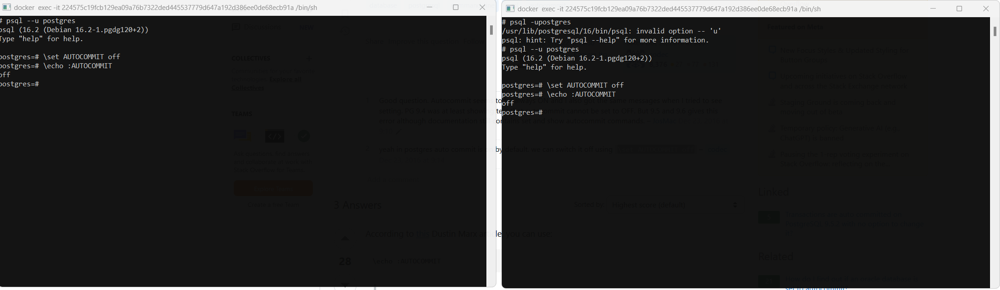
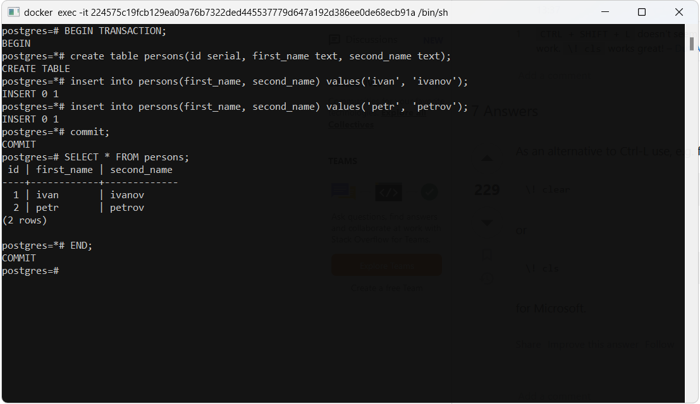

# Ход работы

## Подготовительная часть

1. Немного схитрим и запустим готовый PostgreSQL в контейнере. 

```yaml
services:  
  postgres:  
    container_name: otus  
    image: postgres  
    environment:  
      POSTGRES_USER: ${POSTGRES_USER:-postgres}  
      POSTGRES_PASSWORD: ${POSTGRES_PASSWORD:-password}  
      PGDATA: /data/postgres  
    volumes:  
      - postgres:/data/postgres  
    ports:  
      - "5432:5432"  
    networks:  
      - postgres  
  
networks:  
  postgres:  
    driver: bridge  
  
volumes:  
  postgres:
```

2. Заходим в докер, создаем две сессии, отключаем autocommit
  
3. Создаем табличку persons в первой сессии 
   
## Вопросы

### Вопрос 1.

Увидим ли мы НЕзакомиченные изменения одной транзакции в другой при уровне read commited? 
### Ответ 1.

Нет. Так как dirty read запрещен уровнем изоляции по умолчанию read committed. 

![screen3.png]

### Вопрос 2.

Увидим ли мы закомиченные изменения одной транзакции в другой незавершенной транзакции при уровне read commited? 
### Ответ 2.

Да. После того как изменения закомичены они видны во всех транзакциях при уровне изоляции read commited.  

![screen4.png]

### Вопрос 3.

Увидим ли мы закомиченные изменения одной транзакции в другой незавершенной транзакции при уровне repeatable read? 
### Ответ 3.

Нет. Так как dirty read запрещен уровнем repeatable read  

![screen5.png]

### Вопрос 4.

Увидим ли мы закомиченные изменения одной транзакции в другой незавершенной транзакции при уровне repeatble read? 
### Ответ 4.

Нет. Так как чтобы избежать повторяющегося чтения нужно чтобы каждая транзакция не видела изменений сделанных в других транзакциях.  

![screen6.png]

### Вопрос 5.

Увидим ли мы закомиченные изменения одной транзакции в другой завершенной транзакции при уровне repeatble read? 
### Ответ 5.

Да. Так как после завршения транзакции нам видны все изменения сделанные в других транзакциях.  

![screen6.png]
